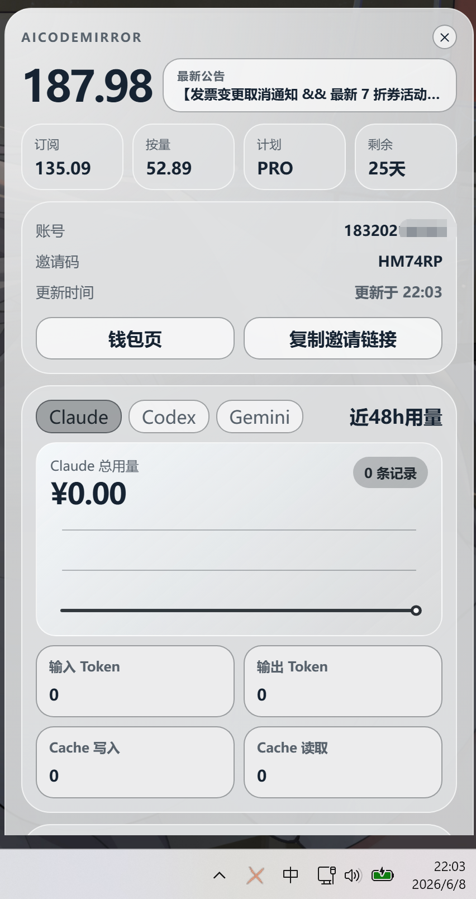
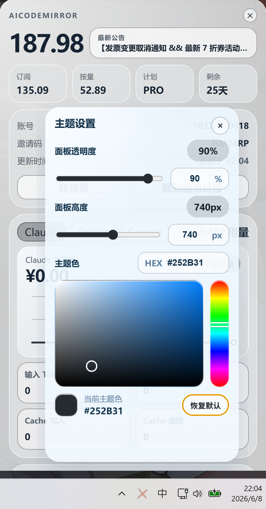
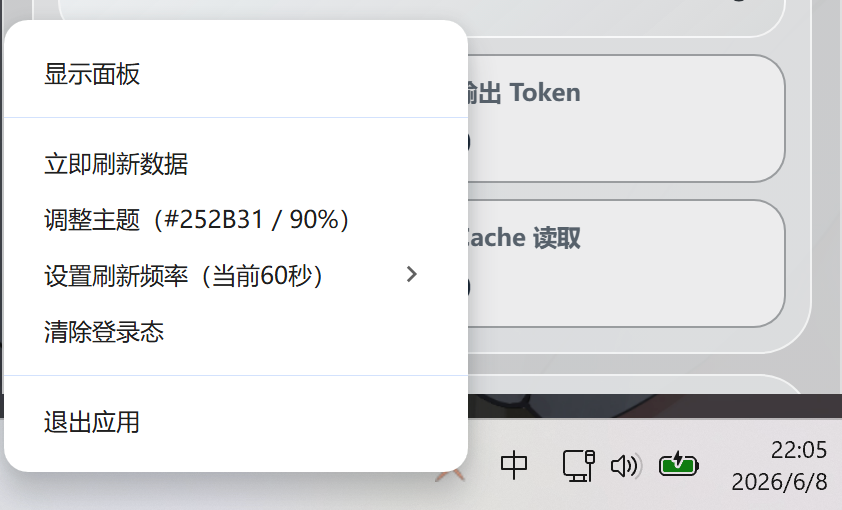
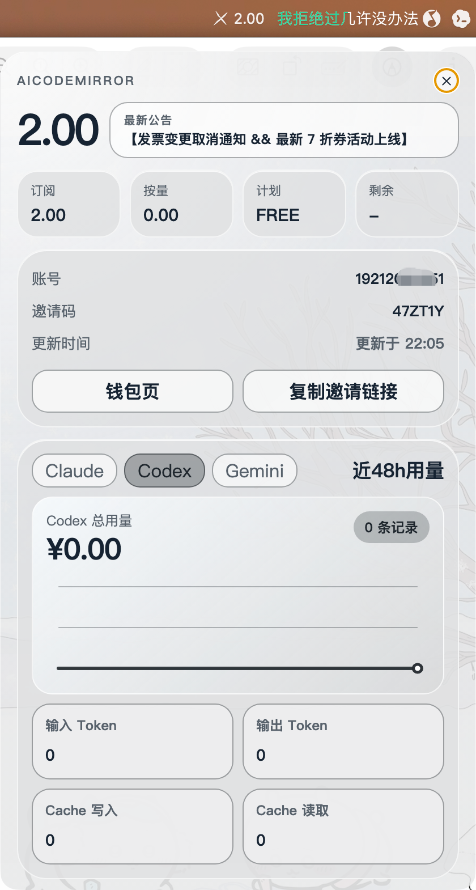
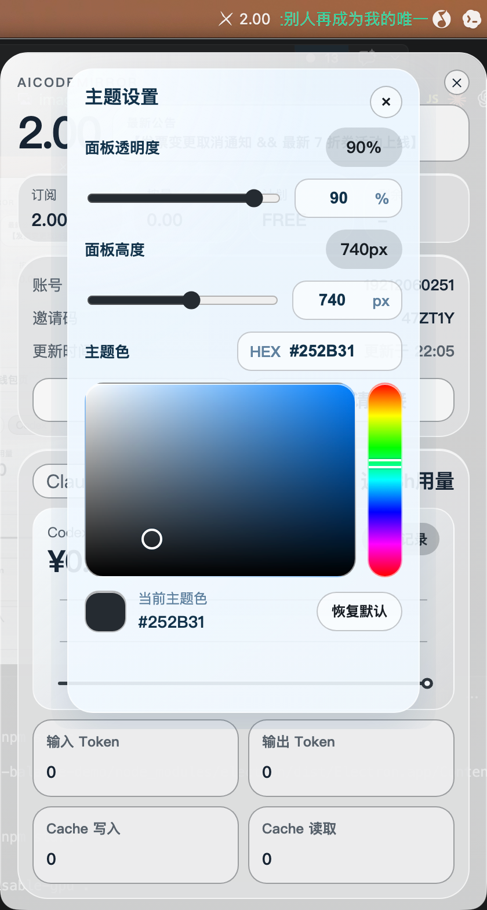
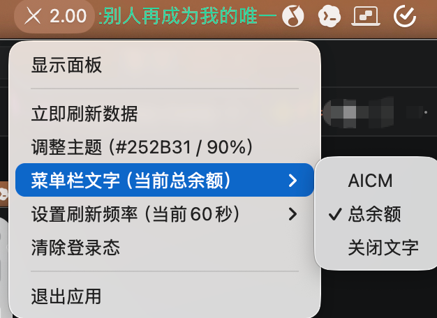

# AICM v2.0

一个面向 AiCodeMirror 用户的桌面托盘余额工具，支持 Windows 和 macOS。应用常驻系统托盘或菜单栏，复用官网登录态，随时查看余额、套餐、API Key 用量和近 48 小时模型消耗。

## 功能概览

- 托盘 / 菜单栏常驻，点击即可展开主面板
- 复用 AiCodeMirror 登录态，首次启动自动进入登录页
- 展示总余额、订阅余额、按量余额、套餐类型、剩余天数
- 展示账号、邀请码、邀请链接，并支持一键复制
- 展示最新公告入口，快速跳转官网公告页
- 按 `Claude`、`Codex`、`Gemini` 分组查看模型与用量数据
- 展示近 48 小时用量趋势、记录数和 Token 统计
- 支持主题设置，包括面板透明度、面板高度、主题色
- Windows 使用无任务栏托盘弹层，优先保证点击展开稳定、不闪烁
- 支持刷新频率配置，范围 `5` 到 `3600` 秒
- macOS 支持菜单栏文字模式切换：`AICM` / `总余额` / `关闭文字`
- Windows 托盘仅显示图标，不支持菜单栏文字模式
- 支持清除登录态、立即刷新和右键快捷操作

## 界面预览

### Windows 主面板

<p align="center">
  
</p>

主面板聚合展示余额、套餐、账号信息、邀请码、近 48 小时用量趋势，以及按模型分组的 Token 数据。

### Windows 主题设置

<p align="center">
  
</p>

支持调节面板透明度、面板高度和主题色，修改后会自动保存，下次启动继续生效。

### Windows 右键菜单

<p align="center">
  
</p>

右键菜单提供显示面板、立即刷新、调整主题、设置刷新频率、登录态管理和退出应用等快捷操作。

### macOS 主面板

<p align="center">
  
</p>

macOS 下保持相同的信息结构和视觉布局，适合在菜单栏场景下快速查看账户状态。

### macOS 主题设置

<p align="center">
  
</p>

主题设置面板在 macOS 上同样可用，方便统一不同设备上的视觉风格。

### macOS 菜单栏文字设置

<p align="center">
  
</p>

macOS 可切换菜单栏文字显示模式，既可以显示应用缩写，也可以直接显示总余额，或关闭文字仅保留图标。

## 使用方式

1. 启动应用后，程序会常驻系统托盘或菜单栏。
2. 首次使用会自动打开 AiCodeMirror 登录页。
3. 登录成功后，应用会开始拉取钱包、邀请码、API Key、模型价格和用量数据。
4. 左键托盘图标可展开主面板。
5. 右键托盘图标可打开快捷菜单，进行刷新、主题调整、刷新频率设置和登录态管理。

## Release 安装

如果只是正常安装使用，不需要本地构建，直接下载仓库 `Releases` 页面中的安装包即可。

- Windows 用户下载 `.exe` 安装包后可直接运行安装。
- macOS 用户下载 `.dmg` 安装包后可直接拖入应用目录安装。
- Release 页面会分别提供 `Windows x64`、`Windows arm64`、`macOS x64`、`macOS arm64` 四个安装包，请按自己的系统架构选择。

## 平台说明

### Windows

- 左键点击系统托盘图标展开主面板，右键打开快捷菜单。
- 为避免透明无边框窗口在 Windows 上出现闪烁，Windows 版默认不使用全透明窗体。
- 面板透明度通过窗口级透明度实现；在支持的 Windows 11 环境下，会额外尝试启用 `Acrylic` 背景材质来保留半透明观感。
- Windows 托盘不支持像 macOS 菜单栏那样显示应用名称或总余额文字，因此仅显示图标。

### macOS

- 应用运行在顶部菜单栏，支持图标旁文字显示。
- 可在 `AICM`、`总余额`、`关闭文字` 三种模式之间切换。
- 面板继续使用透明窗口和菜单栏交互方式。

## 本地开发

```bash
npm install
npm start
```

如遇到个别机器透明窗口渲染异常，可以尝试关闭 GPU 加速后启动：

```bash
AICM_DISABLE_GPU=1 npm start
```

## 打包命令

```bash
# Windows
npm run build:win
npm run build:win:x64
npm run build:win:arm64

# macOS
npm run build:mac
npm run build:mac:x64
npm run build:mac:arm64
```

打包产物输出到 `dist/` 目录。

## 未签名包说明

当前打包产物为未签名安装包，可以正常使用，但在首次打开时，系统可能会弹出安全提醒。

### macOS

- 如果提示“无法验证开发者”或“无法检查是否包含恶意软件”，可先关闭弹窗。
- 在应用图标上点击右键，选择“打开”。
- 如果仍被拦截，可前往“系统设置 -> 隐私与安全性”，在底部找到被拦截的应用并点击“仍要打开”。

### Windows

- 如果出现“Windows 已保护你的电脑”提示，点击“更多信息”。
- 然后点击“仍要运行”即可继续安装。

建议将未签名包用于自测、内部试用或小范围分发；如果需要对外公开分发，建议补充代码签名以减少系统拦截提示。

## 技术栈

- Electron
- Electron Builder
- `session.fetch` 复用应用内登录会话
- 原生托盘 / 菜单栏窗口交互

## 联系方式

如需反馈问题、定制功能或进一步交流，可扫码添加微信：

<p align="center">
  
</p>

## License

MIT
