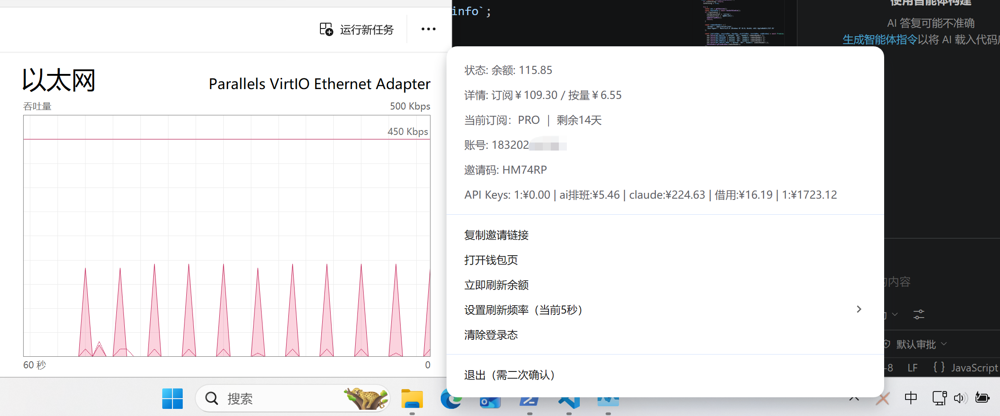
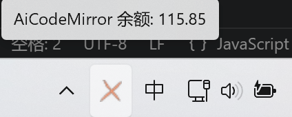
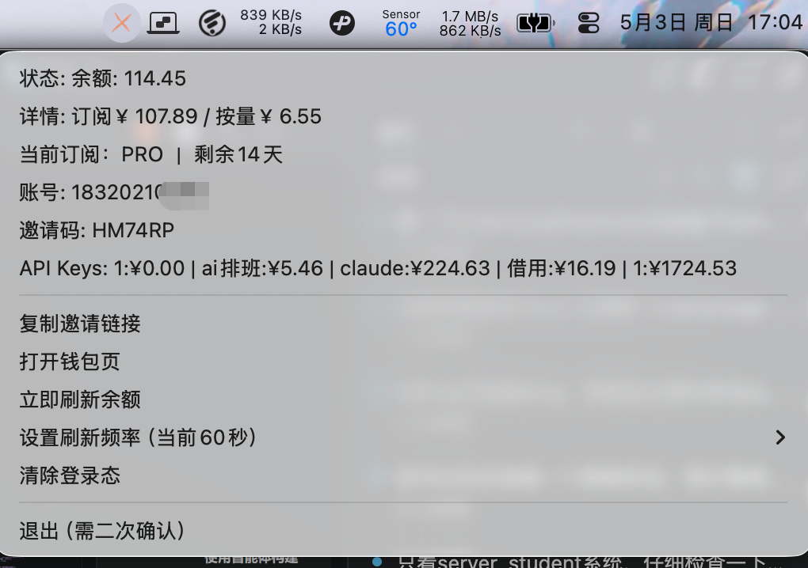
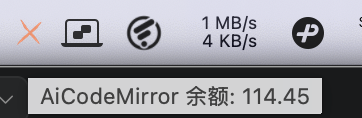

# AiCodeMirror Balance Tray

跨平台（Windows / macOS）的状态栏余额工具，基于 Electron。  
作者：**Cute-chen**  
主页：[https://github.com/Cute-chen](https://github.com/Cute-chen)

## 功能特性

- 状态栏 / 托盘常驻显示
- 内置登录窗口（复用会话）
- 综合余额显示（订阅 + 按量）
- 分项余额显示（订阅余额、按量余额）
- 当前订阅与剩余天数
- 账号信息、邀请码显示
- 一键复制邀请链接
- API Key 名称与总消耗展示
- 刷新频率可配置（秒，最大 3600）
- 清除登录态后自动回登录页
- 退出二次确认，避免误触

## 技术框架

- 框架：Electron
- 网络：`session.fetch`（同容器会话）
- 打包：electron-builder
- 安装包：Windows `NSIS(.exe)` / macOS `.dmg`

## 使用效果

### Windows

<p align="center">
  
</p>

<p align="center">
  
</p>

### macOS

<p align="center">
  
</p>

<p align="center">
  
</p>

## 快速开始

```bash
npm install
npm start
```

## 打包

```bash
# Windows 安装包
npm run build:win

# macOS 安装包
npm run build:mac
```

打包产物位于 `dist/` 目录。

## 安装包体积说明

Electron 安装包体积偏大是正常现象，主要原因：

- 自带 Chromium + Node.js 运行时
- 每个平台都需携带对应运行时与资源

如需减小体积，可考虑：

- 只构建单架构（例如仅 `x64` 或仅 `arm64`）
- 精简打包文件
- 迁移到 Tauri（依赖系统 WebView）

## 安全提示

- 请勿在 issue 或日志中公开 Cookie/Token/完整 HAR 文件
- 登录态失效由服务端策略决定，可能因风控提前过期

## License

MIT
